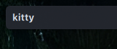

# dumb-app-name-plasmoid

This Plasma 6 widget shows the active application name in bold text.



## Functions

- The widget reads the `AppName` value from the Plasma task model.
- The label uses the panel text color and the system font.
- The label updates when the theme or system font changes. The text stays bold.
- The widget has a transparent background and one line of text.
- The widget has no icons or window buttons.
- The widget shows the active application name on all monitors.
- The task model has no screen, virtual desktop, or activity filters.
- The widget uses the full label width up to 12 grid units. This is approximately 216 pixels with the usual font settings.
- If the name does not fit within 12 grid units, the label replaces the text at the right end with an ellipsis.
- If no task is active, the label is empty.
- If the application name is not available, the label is empty.
- In Plasma edit mode, an empty label shows `Application Name` so you can find and move the widget.

## Application name rules

The following regular expressions match the full application name. Matches are case-sensitive.

| Name pattern | Label |
| --- | --- |
| `Telegram Desktop` | Telegram |
| `Gimp-.*` | Gimp |
| `soffice\.bin` | LibreOffice |
| `Spotify.*` | Spotify |
| `Kate.*` | Kate |

The widget keeps names that do not match a rule.
To change a rule, edit `contents/code/Names.js`.

Plasma supplies the application name.
For example, `LibreOffice Writer` stays `LibreOffice Writer`.
The widget does not use the window title or document title.

## Install on Arch Linux with Plasma 6

The widget does not need compilation or a custom C++ plugin.
The `kpackage` package supplies the `kpackagetool6` command.

1. Get the source files.
2. Open the source directory.
3. Install the widget.

```sh
git clone https://github.com/peterhass/dumb-app-name-plasmoid.git
cd dumb-app-name-plasmoid
kpackagetool6 --type Plasma/Applet --install .
```

4. Open **Add Widgets** from the panel.
5. Find **dumb-app-name-plasmoid**.
6. Add the widget to a horizontal panel.

If the widget does not appear, restart the Plasma shell:

```sh
kquitapp6 plasmashell && kstart plasmashell
```

## Update the widget

Run these commands from the source directory:

```sh
git pull --ff-only
kpackagetool6 --type Plasma/Applet --upgrade .
```

Restart the Plasma shell to load the updated QML files:

```sh
kquitapp6 plasmashell && kstart plasmashell
```

## Remove the widget

```sh
kpackagetool6 --type Plasma/Applet --remove com.github.peterhass.dumb-app-name-plasmoid
```

## Make an installation file

Run this command from the source directory:

```sh
python3 scripts/package.py
```

The script creates `dist/dumb-app-name-plasmoid.plasmoid`.
To install this file, run:

```sh
kpackagetool6 --type Plasma/Applet --install dist/dumb-app-name-plasmoid.plasmoid
```

## Run automated checks

Run the application name tests:

```sh
node tests/names.test.cjs
```

Install the Qt test tools in a Python virtual environment.
These tools are necessary for development tests only.

```sh
python3 -m venv .venv
.venv/bin/pip install PySide6-Essentials==6.11.2
```

Run the QML tests:

```sh
.venv/bin/python tests/test_active_application.py
```

The tests use the widget QML files and a test task model.
The test task model uses its own QML module so that it does not load the installed Plasma task model.
They check these conditions:

- The active task changes.
- The application name changes for the same active task.
- The task model resets.
- The application name is not available.
- The task filters are disabled.

The tests do not check the actual Plasma task model or panel.

On Arch Linux with Plasma 6, run the Qt 6 QML type check:

```sh
/usr/lib/qt6/bin/qmllint contents/ui/main.qml contents/ui/ActiveApplication.qml
```

The `qt6-declarative` package supplies this command.
Use this Qt 6 path because the unqualified `qmllint` command can be a Qt 5 tool.
The check needs the installed Plasma QML modules.
The GitHub Actions workflow checks QML syntax and creates an installation file.
You can get this file from the workflow run.

## Check the widget in Plasma

Complete these checks before a release:

1. Switch between Firefox and Dolphin. Make sure that both full names fit. Include windows on another monitor.
2. Check each application name rule.
3. Change between light and dark Plasma themes. Make sure that the label uses the panel text color.
4. Change the system font. Make sure that the label uses the new font and stays bold.
5. Select the desktop. Make sure that the label becomes empty when no task is active.
6. Close the active window. Make sure that the label shows the new active application or becomes empty.
7. Switch virtual desktops. Make sure that the label shows the active application.
8. Open an application with a name longer than about 30 characters. Make sure that the label shows an ellipsis at the right end.
9. Enter panel edit mode when no task is active. Make sure that `Application Name` appears and that you can move the widget. Exit edit mode. Make sure that the label becomes empty again.

## Instructions for coding agents

Read [AGENTS.md](AGENTS.md) before you change this repository.

## License

The project uses the MIT license. See [LICENSE](LICENSE).
